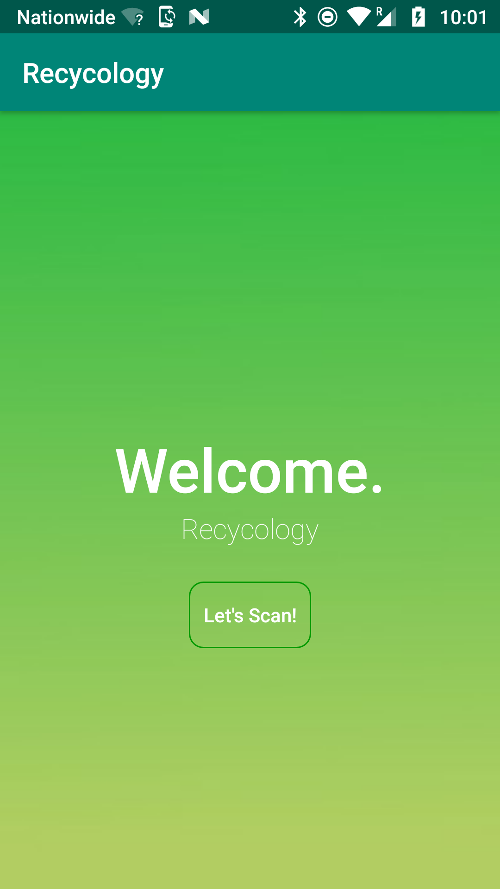
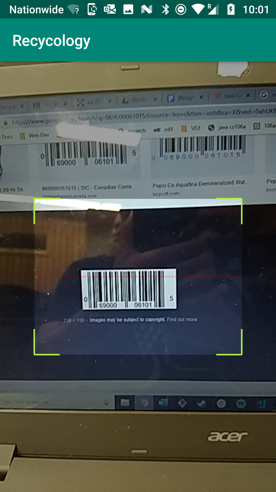
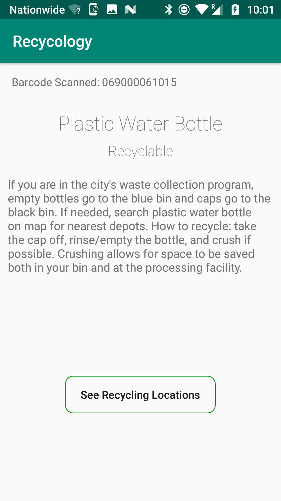
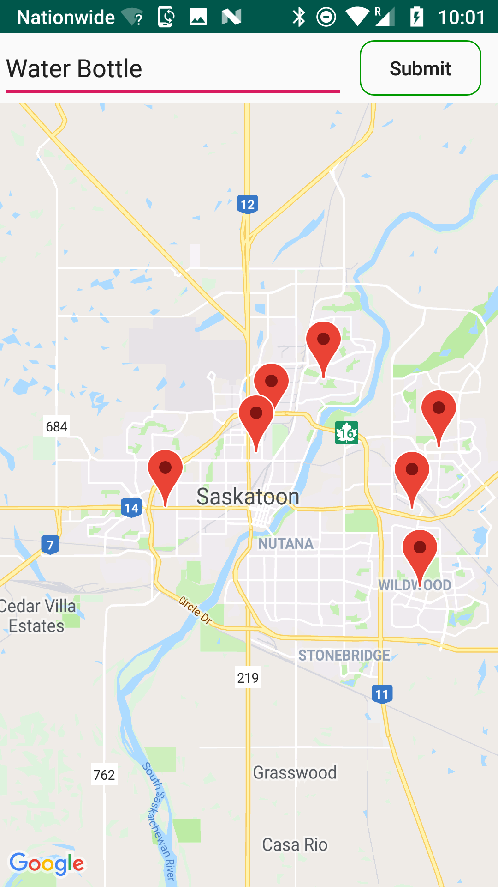
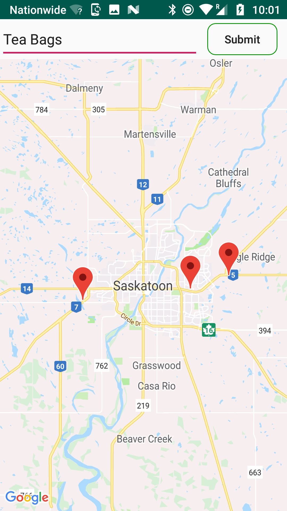

# Recycology

An Android app that can scan barcodes of products and output whether they are recyclable, how to recycle them, and where to do so. Currently works on select items but can be hooked up with a larger database of items in the future. Created as a project for SHAD UofS.  

Screenshots:

